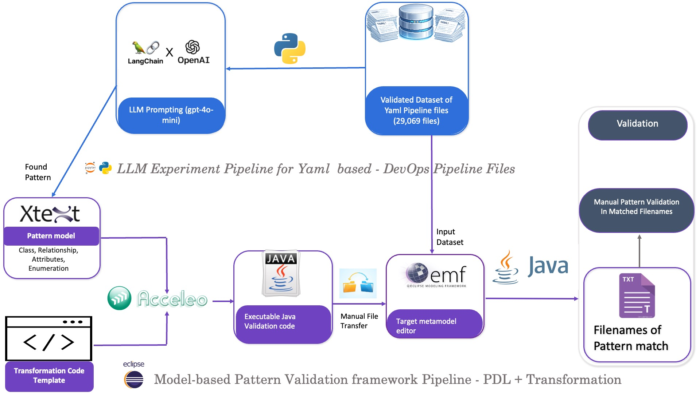

# LLM Experiment
LLM Experiment includes LLM prompting to find patterns and declaring pattern in PDL along with Acceleo based Transformation from Pattern to Java Validation Script and validate pattern occurrence of pattern found by LLM.

