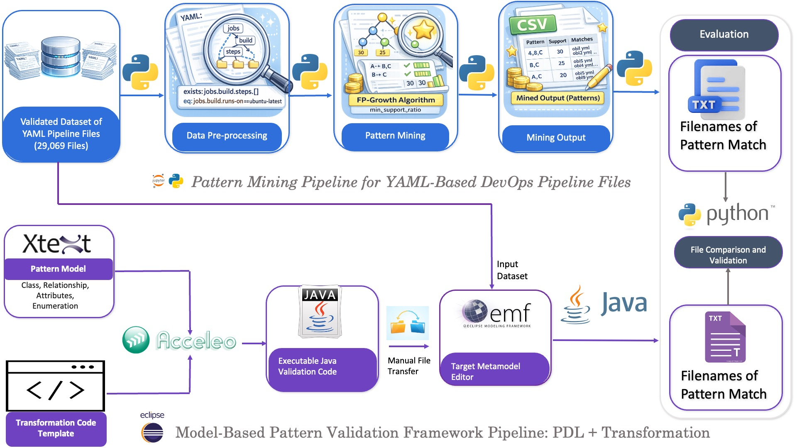

# Pattern-Definition-System
Pattern-Definition-System includes Xtext based Pattern Definition Language and Acceleo based Transformation from Pattern to Java Validation Script. Along with Pattern mining approach using Fp Growth data mining in Python and comparison of the outputs as evaluation.

