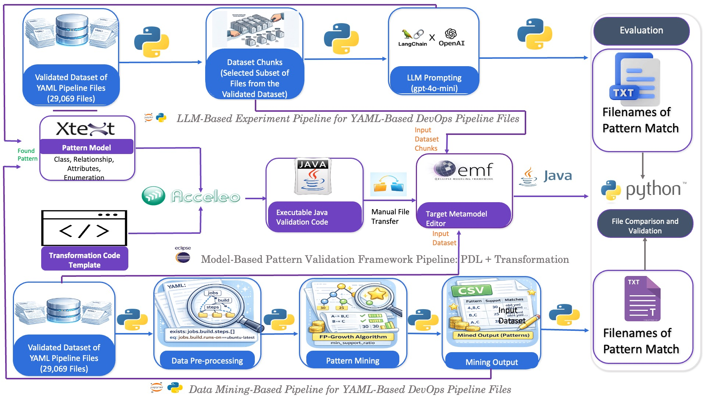
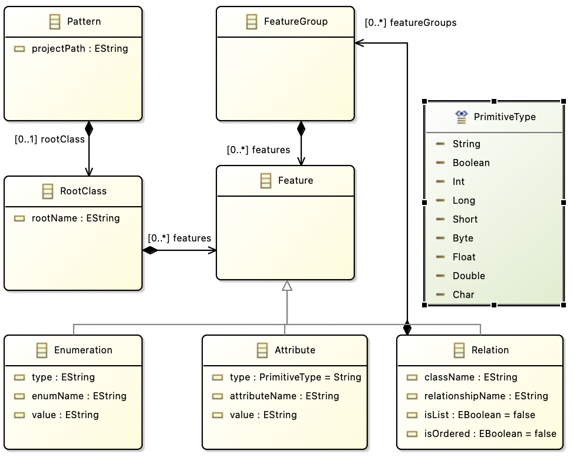

# Pattern-Definition-System
Pattern-Definition-System includes Xtext based Pattern Definition Language and Acceleo based Transformation from Pattern to Java Validation Script. Along with Pattern mining approach using FpGrowth-based data mining in Python and LLM-based and comparison of the outputs as evaluation.

## Metamodel
Concrete Representation of PDL

